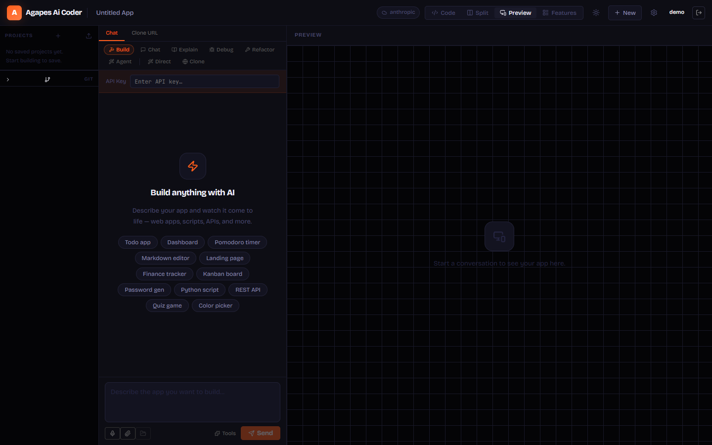

# Agapes AI Coder

> **A self-hosted AI-powered app builder.** Describe what you want to build in plain English — Agapes generates, runs, and iterates on real multi-file projects directly in your browser.

---

## Screenshot



---

## What It Does

Agapes AI Coder is a full-stack development environment that lets you build web apps, scripts, and games using AI — entirely self-hosted. You chat with an AI that generates real code files, which are saved to disk, executed in a live terminal, previewed in the browser, and tracked across versions. All without leaving the page.

**Key idea:** You stay in the loop. The AI proposes a plan, you confirm it, it generates code, and you can review every change as a diff before it lands — or let the agent loop run fully autonomously.

---

## Features

### Core
| Feature | Description |
|---|---|
| 🤖 **AI Code Generation** | Streams multi-file projects from any supported provider. Parses `<forge-file>` blocks to write real files to disk |
| 💬 **Chat Modes** | Build, Debug, Explain, Refactor, Docs, Agent, and more — each with a tailored system prompt |
| 📋 **AI Planning** | Before writing code, the AI proposes a structured plan (files, features, tech stack). You confirm, refine, or cancel |
| 📁 **Multi-file Projects** | Each project is a real folder on disk. Files are shown in a tabbed editor, live preview, and terminal |
| 🖥 **Live Terminal** | Full PTY terminal (xterm.js + node-pty) that runs your app's actual process — Node, Python, Bash, anything |
| 👁 **Inline Diff Review** | Every AI edit shows as a hunk-by-hunk diff. Accept, reject, or keep changes individually before applying |

### Intelligence
| Feature | Description |
|---|---|
| 🔄 **Agent Mode** | Autonomous generate → run → fix loop, up to 5 iterations. The AI fixes its own errors using terminal output |
| 🔍 **Code Intelligence** | Explain, Refactor, or Add Docs buttons on the editor toolbar. Works on selected text or the full file |
| 🧪 **Auto-Test** | Detects test frameworks, runs tests after each generation, feeds failures back to the AI to fix |
| 🎭 **Playwright E2E** | Run end-to-end browser tests against your generated app from within the UI |
| 🌐 **Web Search** | AI can search the web (DuckDuckGo) mid-generation to pull in current docs or APIs |
| 📦 **Package Install** | AI can trigger `npm install` or `pip install` as part of its workflow |

### Project Management
| Feature | Description |
|---|---|
| 📸 **Snapshots** | Save and restore named checkpoints of your project at any point |
| 📋 **Kanban Board** | Track project features as cards across Backlog → In Progress → Completed columns |
| 🔀 **Git Panel** | View and manage the git history of your generated project |
| 📥 **Import Projects** | Import a `.zip` file or individual files to start editing existing code |
| 🔗 **Website Clone** | Paste a URL — Agapes fetches and converts it to an editable project |
| 🚀 **Publish** | Publish any project to a public URL at `/app/:slug` with one click |

### Input
| Feature | Description |
|---|---|
| 🎤 **Voice Input** | Dictate prompts using the Web Speech API |
| 🖼 **Image Attachments** | Attach screenshots or mockups — vision-capable providers will use them |
| 📎 **File Attachments** | Attach project files as context for the AI |

### Provider & Auth
| Feature | Description |
|---|---|
| 🔌 **Multi-Provider** | Anthropic, OpenAI, Gemini, OpenRouter, Ollama, LM Studio, custom OpenAI-compatible |
| 🔍 **Auto-Detect Local** | Scans common ports to detect running Ollama or LM Studio instances automatically |
| 🌙 **Light / Dark Theme** | Warm light and dark ember themes, toggled with a single button, persisted across sessions |
| 🔐 **User Auth** | JWT-based login/register with bcrypt passwords. Per-user API key storage in SQLite |
| 🛡 **Admin Panel** | Manage users, toggle admin, view published apps |

---

## Tech Stack

**Frontend** — `src/`
- React 18 + TypeScript, bundled with Vite
- xterm.js — embedded terminal
- lucide-react — icons
- Vitest + @testing-library/react — 52 tests

**Backend** — `server/`
- Node.js (ESM) + Express 4
- better-sqlite3 — users, API keys, publish records, kanban features
- node-pty — real PTY process execution
- ws — WebSocket streaming for terminal I/O and AI output
- bcrypt + jsonwebtoken — authentication
- jszip — ZIP import support

**Supported AI Providers**

| Provider | Notes |
|---|---|
| Anthropic Claude | `claude-opus-4-7`, `claude-sonnet-4-6`, etc. |
| OpenAI | `gpt-4o`, `o1`, `gpt-4-turbo`, etc. |
| Google Gemini | `gemini-2.0-flash`, `gemini-1.5-pro`, etc. |
| OpenRouter | 1000+ models via unified API |
| Ollama | Local — auto-detected on `localhost:11434` |
| LM Studio | Local — auto-detected on `localhost:1234` |
| Custom | Any OpenAI-compatible endpoint |

---

## Installation

### Prerequisites
- **Node.js 20+** (tested on v24)
- **npm 9+**

### 1. Clone
```bash
git clone https://github.com/agapess/Agapes-Ai-Coder.git
cd Agapes-Ai-Coder
```

### 2. Install dependencies
```bash
npm run setup
```

This installs both the frontend (`/`) and backend (`server/`) dependencies in one step.

### 3. Start
```bash
npm run dev
```

This starts:
- **Backend** on `http://localhost:3001`
- **Frontend** on `http://localhost:5173` (Vite dev server, proxies `/api` to backend)

Open **[http://localhost:5173](http://localhost:5173)** in your browser.

---

## First Run

1. **Create an account** — on first launch, the registration form appears (the first account is automatically an admin)
2. **Set your AI provider** — click the **⚙ Settings** icon in the top-right header
   - Select your provider (Anthropic, OpenAI, Ollama, etc.)
   - Paste your API key
   - Click **Test Connection** to verify
   - For local providers (Ollama / LM Studio), click **Auto-detect** to find them automatically
3. **Start building** — type a description in the chat, e.g.:
   > *"Build a Pomodoro timer with a dark UI, start/stop button, and session counter"*
4. **Confirm the plan** — the AI proposes a plan first. Hit **Yes, build it** or **Change something**
5. **Review the code** — toggle **Diff Review** to inspect every file change before it applies

---

## Usage Guide

### Chat Modes

Switch modes using the row of buttons below the chat input:

| Mode | What it does |
|---|---|
| **Build** | Generates or updates code files |
| **Debug** | Diagnoses errors and suggests fixes |
| **Explain** | Explains selected code or the whole project |
| **Refactor** | Improves code quality without changing behavior |
| **Docs** | Adds documentation comments |
| **Agent** | Fully autonomous loop: generates, runs, fixes — up to 5 rounds |
| **Chat** | General conversation without code generation |

### View Modes

The top-right toolbar switches between:

| View | Description |
|---|---|
| **Code** | Tabbed file editor with syntax highlighting |
| **Split** | Editor + live preview side by side |
| **Preview** | Full live preview of your running app |
| **Features** | Kanban board for tracking project features |

### Kanban Board

Click **Features** in the view toggle to open the feature board for the current project:
- **Backlog** — planned work
- **In Progress** — active development
- **Completed** — done

Add features with the **+ Add feature** button. Each card has a category (Functional / Style), optional description, and a one-click status promoter.

### Snapshots

Click the **clock icon** in the code panel toolbar to save a named snapshot. Restore any previous snapshot from the timeline to roll back the entire project state.

### Publishing

Click **Publish** in the sidebar to deploy your project to a public URL:
```
http://localhost:3001/app/your-slug
```

### Diff Review Mode

Enable **Review Mode** (pencil icon in the code panel) before sending a message. All AI changes will be shown as a side-by-side diff. Accept or reject each hunk individually, then confirm or discard the whole batch.

---

## Configuration

### Environment Variables

| Variable | Default | Description |
|---|---|---|
| `JWT_SECRET` | Random (per-start) | Set a stable secret in production so sessions survive server restarts |
| `PORT` | `3001` | Backend port |

Set them in a `.env` file in the project root or `server/` directory, or export them before starting:

```bash
export JWT_SECRET=your-long-secret-here
npm run dev
```

### Project Storage

Generated projects are stored as real folders under `server/data/projects/`. Each project folder contains the generated files exactly as the AI produced them — you can open them in any editor.

---

## Development

```bash
# Run tests (52 unit tests)
npm test

# Watch mode
npm run test:watch

# Type check
npx tsc --noEmit

# Build for production
npm run build
```

### Project Structure

```
Agapes-Ai-Coder/
├── src/                    # React frontend
│   ├── components/         # UI components
│   │   ├── ChatPanel.tsx   # Chat interface + mode selector
│   │   ├── CodePanel.tsx   # File editor + code intelligence
│   │   ├── KanbanBoard.tsx # Feature tracker
│   │   ├── DiffPanel.tsx   # Inline diff review
│   │   ├── TerminalPane.tsx
│   │   ├── PreviewPanel.tsx
│   │   ├── Sidebar.tsx
│   │   ├── Header.tsx
│   │   └── ...
│   ├── hooks/              # React hooks
│   │   ├── useProject.ts   # Core project state + AI messaging
│   │   ├── useExecution.ts # Terminal / PTY
│   │   ├── useAuth.ts      # Login / register / logout
│   │   └── ...
│   └── App.tsx             # Root component + layout
├── server/                 # Node.js backend
│   ├── index.mjs           # Express routes + WebSocket server
│   ├── db.mjs              # SQLite helpers
│   ├── execution.mjs       # PTY execution manager
│   ├── providers/          # AI provider adapters
│   └── mcp/                # Tool integrations (search, packages, snapshots, tests, clone)
├── docs/
│   └── assets/             # Screenshots and documentation images
└── package.json
```

---

## Roadmap

- [ ] Multi-user project sharing
- [ ] Plugin/MCP tool marketplace
- [ ] Cloud deployment (Docker image)
- [ ] Real-time collaboration

---

## License

MIT — free to use, modify, and self-host.

---

<div align="center">
  Built with ❤️ using React, Node.js, and the power of local + cloud AI models.
</div>
